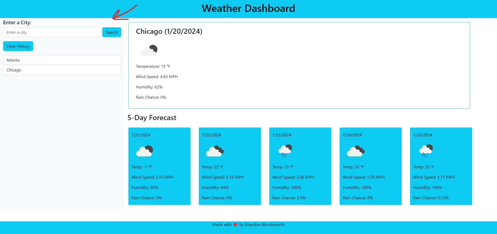

# Brand Weather Dashboard

Brand Weather Dashboard is a simple web application that allows users to search for a city and get the current weather along with a 5-day forecast. The current weather and forecast include temperature, wind speed, humidity, and chance of rain.

**Deployed Web Page**

[https://brandblood97.github.io/Brand-Weather-Dashboard/](https://brandblood97.github.io/Brand-Weather-Dashboard/) 

## Usage

1. **Search for a City:** Use the search bar to type in the name of the city you want to check the weather for.

2. **Click Search:** After entering the city name, click the "Search" button to retrieve the current weather and 5-day forecast for the specified city.

## Dependencies

Brand Weather Dashboard has no external dependencies, making it easy to use without the need for additional installations.

## Installation

No installation is required for Brand Weather Dashboard. Simply access the application through the provided URL.

## Contribution

This project is open for contributions. If you find any issues or have suggestions for improvements, feel free to submit a pull request.

## License

Brand Weather Dashboard is released under the [MIT License](LICENSE).
